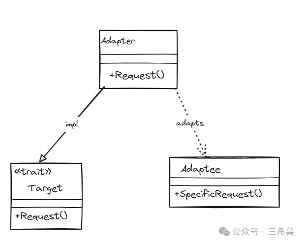
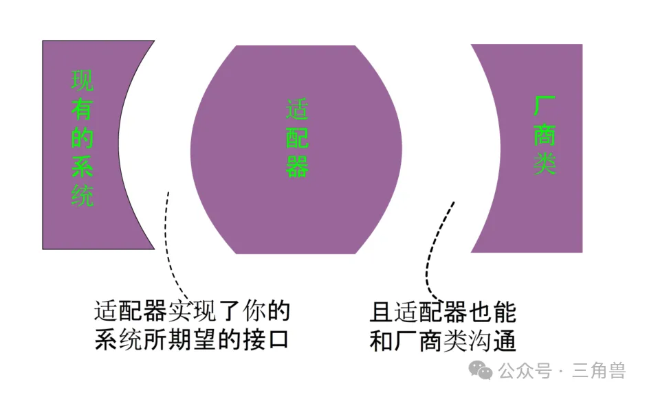

# 适配器模式

## 概念

将一个类的接口编程客户期望的另一种接口，从而使原本因接口不匹配而无法在一起工作的两个类能够在一起工作

## UML

## 适用场景

- 需要使用现有的接口，而这些接口不符合系统的接口
- 使用第三方组件，组件接口定义和自己定义不同，并且不希望修改自己的接口，但是又希望使用第三方组件接口的功能

## 参考

[适配器模式](https://mp.weixin.qq.com/s?__biz=Mzg5MDE5NDc4MQ==&mid=2247484476&idx=1&sn=05e2d8f50423b84a34eed48f9547c0cc&chksm=cfe11a0ef8969318ec63602f62c704fe4ae6a8c90532499df4826f8b6022afe00d1bda661bd3&scene=21#wechat_redirect)