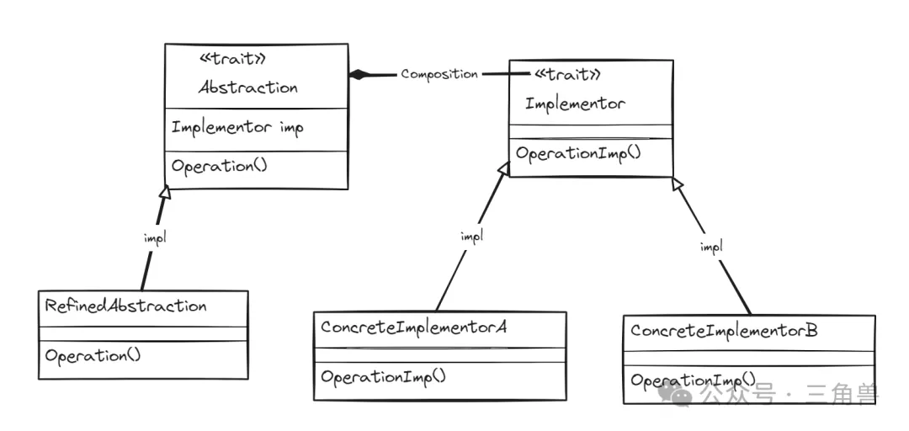
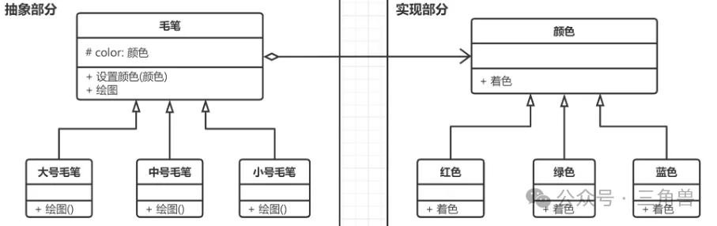

# 桥接模式

## 概念

用于将抽象部分与实现部分分离，使得两者可以独立的改变。它的核心是识别出一个类所具有的两个独立变化的维度，将它们设计为两个独立的继承等级结构，两个维度都提供抽象层，并建立抽象耦合

### 组成要素

- 抽象( Abstraction ): 定义抽象部分的接口，可以包含一个实现部分的引用，并声明与实现部分相关的方法
- 实现( Implementor ): 定义实现部分的方法
- 具体实现( Concrete Implement ): 具体实现 Implementor 中声明的方法

## UML

### 解读

拿毛笔举例，型号和颜色是毛笔的两个维度:

- 型号是一个维度，抽象出一个毛笔类，各种型号的毛笔作为其子类
- 颜色是另外一个维度，它与毛笔之间存在一种设置关系，因此抽象出一个颜色类，将具体颜色作为其子类

### 使用场景

需要将抽象与实现解耦，以便他们可以独立应用到场景中

### 优点

- 解耦合: 抽象部分与实现部分分离，降低了它们的耦合度
- 可复用性: 实现部分可以被不同的抽象部分复用
- 灵活性: 可以在运行时根据需要动态的组合抽象部分和实现部分

## 参考

[三角兽-桥接模式](https://mp.weixin.qq.com/s?__biz=Mzg5MDE5NDc4MQ==&mid=2247484556&idx=1&sn=1eb435a3dbbbae547925692f3b65dcb1&chksm=cfe11abef89693a877349c7624250b01d3c694a203af62463a8056876188d6b9cb0adf52fb4d&scene=21#wechat_redirect)
