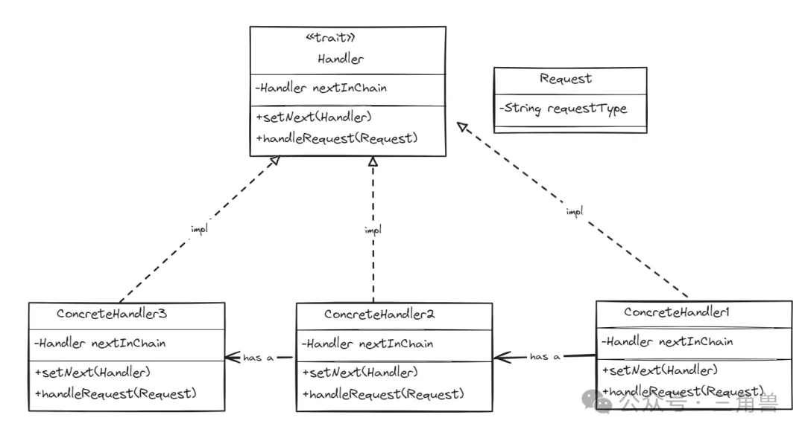

# 责任链模式( chain of responsibility )

## 概念

允许将请求沿着处理者链进行发送，请求会沿着链传递，知道某个处理者对象负责处理它

### 组成要素

- 处理者(Handler): 处理者特征，它定义了一个处理请求的方法和指向下一个处理者的引用
- 具体处理者( Concrete Handler ): 实现处理者特征，它负责处理特定的请求，也可以将请求传递给链中的下一个处理者
- 客户端( Client ): 负责创建并配置责任链，它将请求发送给链中的第一个处理者

## 优点

- 将请求的发送者和接受者解耦合。请求沿链传递，发送者不需要知道链中有哪些处理者，降低了系统的耦合度
- 可以很容易的增加或删除处理者而不需要修改已有的代码，增强了系统的灵活性
- 因为可以容易的增加或删除处理者，因此系统具有很好的可扩展性

## 请求传递过程

- 客户端创建并配置好责任链，将请求发送给链中的第一个处理者
- 处理者接收到请求后，首先判断是否能够处理该请求:
  - 如果能够处理，则处理请求并结束；
  - 如果不能处理，则将请求传递给链中的下一个处理者
- 请求沿着链传递，直到有一个处理者能够处理它

## 应用场景

- 过滤器链
- 消息处理器链
- 算法链
- 问答系统

## UML

## 参考

[三角兽-责任链模式](https://mp.weixin.qq.com/s?__biz=Mzg5MDE5NDc4MQ==&mid=2247484528&idx=1&sn=5b8f9120b4f4a36b0f794b9cdb9b5ab5&chksm=cfe11a42f8969354fec1705c8e87d5abd22023928026e29688f088feb81daf373b849c42c9ed&scene=21#wechat_redirect)
