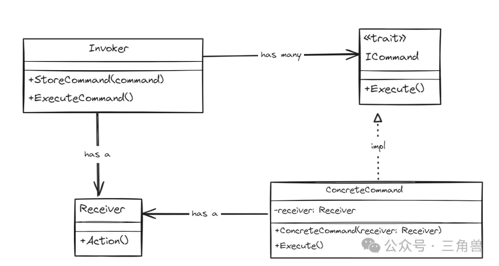

# 命令模式

## 概念

将请求封装为一个命令对象，将发出命令的责任和执行命令的责任分开，从而实现解耦。在命令模式中，发送者只需要知道如何发送请求而不需要知道请求的具体执行过程

## 核心组成

- 命令接口( command ): 定义了执行操作的接口，通常包括一个执行方法
- 具体命令( concrete command ): 实现命令接口，并持有命令接受者的引用
- 接受者( receiver ): 负责执行欲请求相关的操作
- 请求者( invoker ): 负责调用命令对象执行请求

## 优点

- 解耦合:  请求者只需要与命令接口耦合，不需要知道任何执行者的实现细节
- 容易扩容: 很容易增加新的命令，只需要添加新的命令类
- 可组合: 命令可以组合使用，实现复杂的命令
- 可撤销: 命令可以设计成可撤销的，通过调用测小方法恢复到执行前的状态

### 例子

假如有一个电视遥控器，遥控器中的命令可以用命令模式实现，过程如下：

- 命令接口(command):定义了执行和撤销的操作
- 打开电视命令(concrete command):实现了命令接口，内部持有电视机的引用，知道如何打开和关闭电视
- 电视(receiver)：负责打开和关闭电视
- 遥控器(invoker):负责发出打开和关闭的命令

## UML

## 参考

[三角兽-命令模式](https://mp.weixin.qq.com/s?__biz=Mzg5MDE5NDc4MQ==&mid=2247484508&idx=1&sn=2440dfb9aa5dbec0a2f68f5a3c212534&chksm=cfe11a6ef896937842da6b5564d0ca5e80c61a4ab4b036a04a4b1660d185618121fa03e4487f&scene=21#wechat_redirect)
