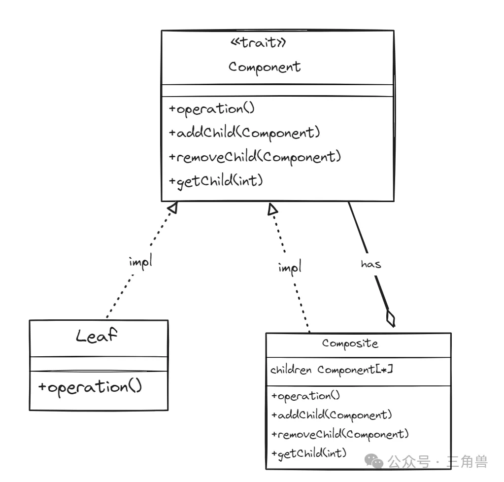

# 组合模式

## 概念

将对象组合成树形结构，以表示 "部分-整体" 的层次结构

### 组成要素

- 组件( component ): 组合模式中的抽象类，用于规范叶子和组合对象的接口。定义了在组合对象和叶子对象中通用的操作
- 叶子( Leaf ): 表示组合中的叶节点对象，它们没有子节点
- 组合( composite ): 实现 component 接口的类，用来存储子组件，代表组合对象

## 优点

- 使代码具有可复用性和可维护性: 客户端可以统一使用 component 接口来操作组合中的对象，无需区分是叶子还是组合节点
- 灵活性: 客户端可以使用统一的方式处理组合对象和叶子对象，使得添加和删除节点更加灵活
- 控制复杂度：将对象组合成树形结构，可以简化复杂的数据结构

## UML

## 参考

[三角兽-组合模式](https://mp.weixin.qq.com/s?__biz=Mzg5MDE5NDc4MQ==&mid=2247484521&idx=1&sn=494b8d5c6e5b84c1622e634603c5e7c7&chksm=cfe11a5bf896934d3ed43142e99306fe0519278f8be44eb10c2eec39d359c18f608f1c7c83a1&scene=21&poc_token=HNh8kmajo4uSY_xzeY8pfahAdsNcr2sTEdkg2_u9)
