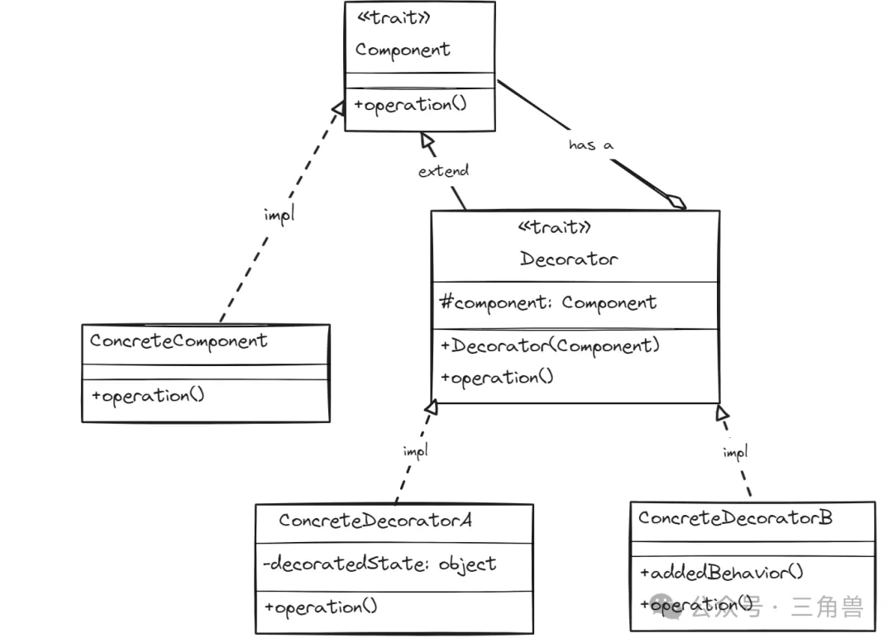

# 装饰器模式

## 概念

一种允许你动态地给一个对象添加额外的职责，而不是通过修改代码或者创建新的对象来实现。这种模式创建了一个装饰器，用来包装原来的类，并增加额外的功能

### 组成要素

- 组件(component): 定义了所有对象都有的特征
- 具体组件(concrete component): 实现 component 特征
- 装饰器(decorator): 扩展 component 特征，并持有一个 component 的引用
- 具体装饰器(concrete decorator): 实现 decorator 特征，并允许添加额外的功能

## UML

## 使用场景

- 当需要给现有的对象添加额外的功能，而不是通过修改它的代码或创建一个新的类来实现时
- 当需要动态的给一个对象添加功能，并且还能动态撤销时

## 优点

- 装饰器在不改变接口的前提下，增强类的功能

## 缺点

- 会产生很多小的对象，增加系统的复杂性，造成类型爆炸

## 参考

[三角兽-装饰器模式](https://mp.weixin.qq.com/s?__biz=Mzg5MDE5NDc4MQ==&mid=2247484587&idx=1&sn=87ed86106096282487f0b6132c0e349a&chksm=cfe11a99f896938fe50986dcb5bd62c10d3113d6bc176c9ef2243ccf0fe4c9bf6eb221321bab&scene=21#wechat_redirect)
