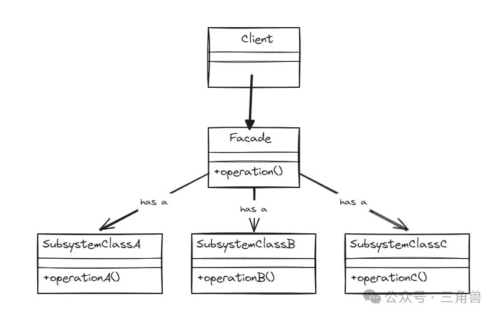

# 设计模式 - 外观模式

## 概念

外观模式为子系统中的一组接口提供一个统一的对外接口，用于简化子系统之间的交互，使得客户端只要通过这个统一的接口与子系统交互，无需直接与子系统的各个接口交互。

这有助于降低客户端与子系统之间的耦合度

## 实现方式

由三部分组成:  外观 Facade 、子系统、客户端。Facade 定义了一个统一的接口，用于访问子系统中的一组接口。子系统是外观模式的核心，负责处理具体的业务逻辑，一个子系统可以包含很多接口，Facade 通常与子系统中的一个或多个接口进行交互。客户端通过 Facade 与子系统交互，而无需了解子系统复杂的内部结构

## UML

### 优点

- **降低耦合度**： 外观模式将客户端与子系统之间的耦合度降低，使得客户端与子系统之间的关系更加灵活
- **提供可维护性**： 通过提供一个统一的接口，外观模式简化了客户端与子系统的交互，是的系统更易于维护
- **保护子系统**：外观模式限制了客户端对子系统的直接访问，有助于保护子系统免受非法访问和修改
- **扩展性好**： 外观模式允许在不修改现有代码的情况下，轻松的为系统添加新的子系统

### 缺点

- **谨防过度设计**: 如果一个系统没有复杂的子系统，使用外观模式导致过度设计

## 参考

[三角兽-外观模式](https://mp.weixin.qq.com/s?__biz=Mzg5MDE5NDc4MQ==&mid=2247484489&idx=1&sn=148d2cb28c0ed013dd6af332e9cf5da2&chksm=cfe11a7bf896936d0c053b50105de0251932aaaa775df74619a56fdfd46a8535582ef87742fd&scene=21#wechat_redirect)
