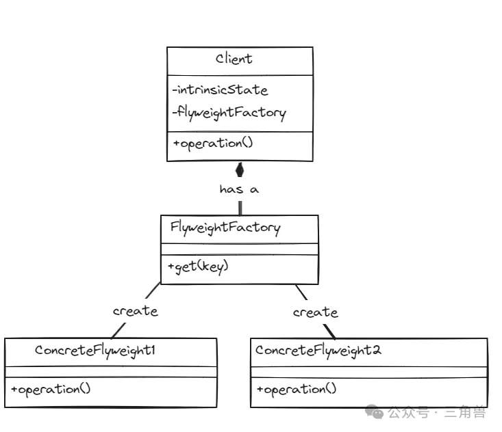

# 享元模式

## 概念

使用共享对象有效的支持大量的细粒度对象。主要用于性能优化，尤其是当系统中存在大量的细粒度对象，而这些对象的大部分属性都是相同的。只有少部分属性不同的时候，享元模式可以通过共享尽可能多的相似对象来减少对象的创建，从而降低内存的使用，提高程序的性能。

## 实现方式

在享元模式中有一个享元池，用于存储已经创建的对象。当需要新的对象时，首先从享元池中查找是否存在符合条件的对象，如果存在，则复用该对象，如果不存在，则创建一个新的对象，并存入享元池中供后续使用

## 使用场景

- 系统中有大量的细粒度对象
- 对象的创建和销毁代价高昂
- 对象的大部分状态是可以共享的
- 需要频繁创建和销毁对象

这种模式在图形界面设计、数据库连接管理、网络编程等领域有广泛的应用

## UML

## 参考

[三角兽-享元模式](https://mp.weixin.qq.com/s?__biz=Mzg5MDE5NDc4MQ==&mid=2247484495&idx=1&sn=8529e41ae5be39d82792f0a27b57825d&chksm=cfe11a7df896936bb65dabcb1d27d8d1f12295ced6384ded7b486185031a665400347b2fa4bc&scene=21#wechat_redirect)
