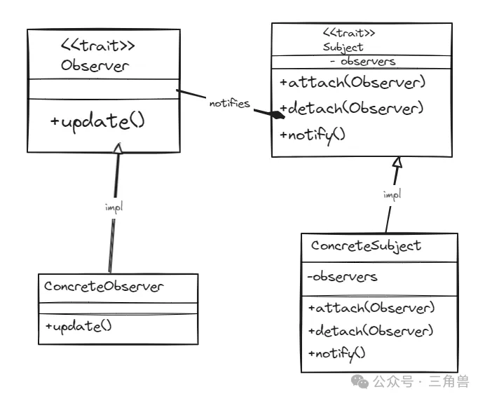

# 观察者模式

## 概念

通过定义一种一对多的依赖关系，让多个观察者同时监听某一个主题，当主题状态发生变化时，会通知所有的观察者对象，以更新它们自己的状态

## UML

## 实现方式

观察者模式主要设计到抽象主题、抽象观察者、具体主题、具体观察者四类角色。

抽象主题提供新增和删除观察者的接口，当主题状态发生变更时，调用 nofity 接口通知所有的观察者。

具体主题中有一个 observers 集合，用于保存所有观察者的引用。

抽象观察者定义了 update 接口，在得到主题的通知时更新自己。主题可以将信息 "推" 给观察者或者只告知观察者状态发生变化，由观察者主动调用主题上的 "拉" 取方法获取具体的消息

### 优点

遵守 "开闭原则"、"职责单一原则"、"接口隔离原则"和"依赖倒置原则"。当有新的观察者加入时，只需要注册到主题上即可

### 使用场景

在 Master-Slaves 结构的分布式系统中，例如: Spark、Hadoop 等系统中， master 和 slave 的协同关系就可以shooing观察者模式。

常用的消息中间件，如: Kafka、RocketMQ 等订阅消费消息，通常采用观察者的 "拉" 模式

## 参考

[设计模式之观察者模式](https://mp.weixin.qq.com/s?__biz=Mzg5MDE5NDc4MQ==&mid=2247484469&idx=1&sn=cdf2f08250f68ae9e49a6632f3eb4d70&chksm=cfe11a07f8969311299b30896ba8d29a695d1e23c26bb98c23d8f49dfc96d820888cd3eb617f&scene=21#wechat_redirect)
