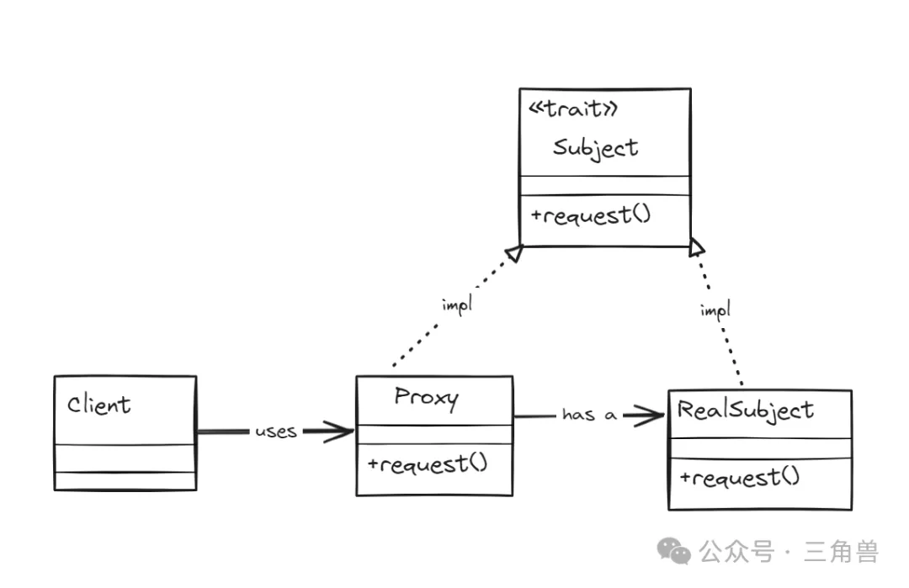

# 代理模式

## 概念

允许我们为其他对象创建代理或占位符一控制这个对象的访问

## 应用场景

- **远程代理**: 当目标对象在不同的地址空间( 不同的进程或计算机 )时，可以使用代理来简化访问
- **虚拟代理**：当创建对象非常耗时或需要大量的资源时，可以使用代理来延迟对对象的创建
- **安全代理**：当需要控制对目标对象的访问权限时，可以使用代理来限制对对象的访问、
- **同步代理**：当需要确保多个并发线程安全地访问目标对象时，可以使用代理来实现同步

## 优点

- **提升安全性**：通过代理可以减少对对象的直接访问，可以限制对目标对象的访问，从而提升应用程序的安全性
- **简化访问**：提供来一种对目标对象透明的访问方式，使得对目标对象的访问更加合理

## 缺点

- **增加复杂性**：因为它需要创建一个代理类来包装目标对象
- **降低性能**：因为需要处理额外的代理逻辑

## UML

## 参考

[三角兽-代理模式](https://mp.weixin.qq.com/s/l8zzrxaS0YlWJGAF6FBpzA)
