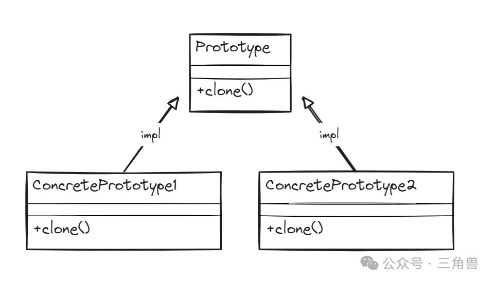

# 原型模式

## 概念

通过复制现有实例来创建新的实例，而不是通过构造函数创建新的实例。在原型模式中，原型对象负责创建它的副本，并通过共享原型来避免创建成本。

这种模式在创建复杂对象且初始化成本较高，或者需要大量相似对象时非常有用

### 关键组成

原型类( prototype ): 负责创建自身的副本

克隆方法( clone method ): 负责创建并返回当前对象的一个副本。通常，这个方法需要处理深拷贝和浅拷贝的问题

## 优点

性能优化: 避免了复杂对象的频繁构造

延迟初始化: 可以在需要时才创建对象

易于维护: 新增或修改原型时，客户端代码无需修改

## 缺点

复杂性: 处理深拷贝和浅拷贝时可能导致代码过于复杂

## UML

## 参考

[三角兽](https://mp.weixin.qq.com/s?__biz=Mzg5MDE5NDc4MQ==&mid=2247484514&idx=1&sn=5d4cfae291f3bc24fd528918b2c08c51&chksm=cfe11a50f8969346514d6cd81577f6d7659dbea5a27582fe5806795031de77c0df9e501785f7&scene=21#wechat_redirect)
