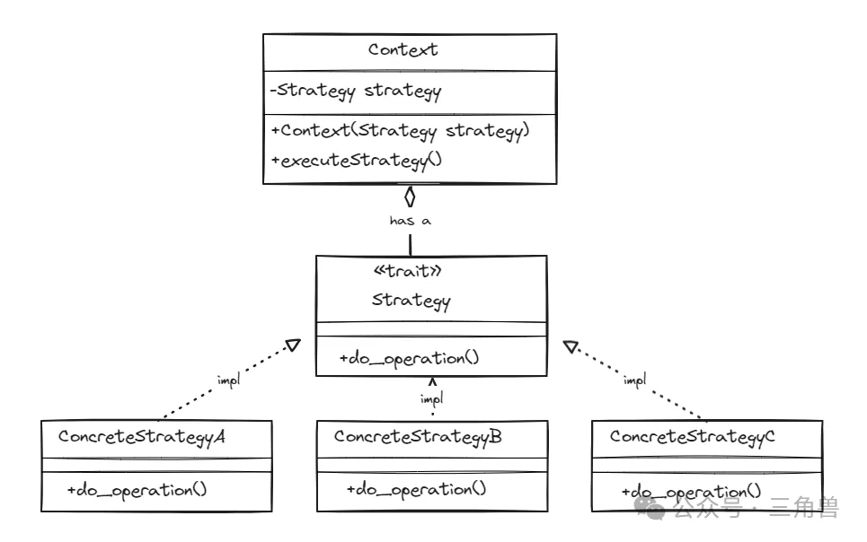

# 策略模式

## 概念

定义一些列算法，把他们一个个封装起来，必要的时候可以相互替换。策略模式让算法的定义独立于使用算法的用户

### 实现方式

策略模式中，通常会有一个策略接口，他定义了所有支持的策略必须实现的共同操作。会有多个策略类，每个都实现策略接口并实现具体的算法

### 优点

遵循 "开闭原则"，可以在不修改现有代码的情况下，向系统中添加新的策略。策略模式还训玉客户端在不了解策略实现的情况下，选择和切换策略，提供了很高的灵活性和可配置行。

  - 在一个排序场景的上下文中，策略模式可以用来定义不同的排序算法( 如: 快排、归并、冒泡等 )，具体的排序策略可以在运行时根据需要选择和切换

## UML 

## 参考

[策略模式](https://mp.weixin.qq.com/s?__biz=Mzg5MDE5NDc4MQ==&mid=2247484483&idx=1&sn=f0c2d8de8dd22d84bf8fc881cd3d7961&chksm=cfe11a71f8969367c43aaacb1fa847308b5429a25ab37350bf4010095a6c525f6b74724f80c8&scene=21#wechat_redirect)
